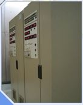

% Hospital
% Innocenzo Biondo
% June 18, 2015

# Hospital

## Administration Suite

- The Department of Plastic Surgery Administration Suite

------------------

Situato a Bellevue dal 2009, l'Administration Suite occupa un'ala dello storico "A Building" al Bellevue Hospital. Composta da uffici centrali per il presidente e Amministratori del Dipartimento, così come per il Capo Servizio e chirurghi con il loro personale di supporto, forniscono una posizione centrale per tutte le funzioni amministrative del Dipartimento. C'è anche una sala conferenze multimediale.

- Hospital Administration Suite (Rush Copley Medical Center)

------------------

-- Sala consiglio con monitor/TV 80"

-- Sala conferenze

-- Ufficio esecutivo

-- CEO office suite

## Medical Library 
- The Royal College of Physicians and Surgeons of Glasgow

------------------

## Medical Record
### Definizione
L'archivio medico è stato definito come un "clinico,scientifico,administrativo con documenti legali relativi alla cura del paziente, con la quale sono ricordati in modo sufficente i dati scritte in sequenze o eventi, per giustificare le diagnosi, e garantire il trattamento e alla fine i risultati"

------------------

------------------

------------------

## Meeting Rooms

------------------

## Data Center and server Room

------------------

###GENERATORI DI ENERGIA RIDONDANTI
I data centers sono progettati con sistemi di energia ridondanti 
per permettere di fornire ininterrotamente il servizio in uno spiacevole 
evento in un totale black out. Questi generatori di energia elettrica funzionano 
con il diesel.

------------------

------------------

###SERVER ROOM
Armadi hostway rack  equipaggiati con i migliori componenti del settore e con cablagi ridondanti, 
il cablaggio è di alta qualità necessario per il collegamento alla nostra
spina dorsale principale. 
La zona di produzione è completamente ridondante di aria condizionata 
e di un sistema di rilevazione incendio precoce.

------------------

------------------

###ACCESSO DATA CENTER
L'accesso del data center è strettamente regolamentato e limitato
da accesso con chiave magnetica. 
Inoltre, telecamere a circuito chiuso controllano continuamente tutti i punti di
accesso. Non è permesso entrare nel sito. Per entrare nel sito, c'è un passaggio controllato
e limitato ulteriormente dallo scanner biometrico di impronte digitali,
schede di accesso e gli armadietti o gabbie sono chiusi a chiave.

------------------

------------------

###CORE NETWORK ROOM
La rete è composta da router, switch, hub ecc.

------------------

###NETWORK OPERATION CENTER
I data center sono monitorati in locale e da remoto Network Operations Centers (NOC). Ogni NOC 
è dotata di sistemi di state-of-the-art di controllare e mantenere la salute e le prestazioni di
rete e livello di sistema. Lo staff è sempre disponibile 24x7x365 per fornire
supporto e garantire che tutti i problemi dei clienti vengono risolti.

------------------

------------------

###UNINTERRUPTIBLE POWER SUPPLY (UPS)
I sistemi UPS proteggono da interruzioni durante brown-out
e di fornire il ponte fondamentale tra la rete elettrica e l'energia del generatore durante lunghi black-out.

------------------

###FIRE SUPPRESSION
Sistemi di antincendio.

------------------

###ELECTRICAL POWER DISTRIBUTION SYSTEM
Sistemi di distribuzione dell'energia elettrica con tempo di attività continui sono assolutamente fondamentali
per garantire il 99,9% di tempo di attività. Una interruzione momentanea può
significare disastri. Data center sono progettati con alimentazioni in parallelo 
per la ridondanza e scalabilità. L'hostway impiega anche il monitoraggio di
alimentazione elettrica per la protezione contro il sovraccarico elettrico.

------------------

------------------

###ELECTRICAL SWITCHGEAR
Quadri elettrici

------------------

###REDUNDANT COOLING SYSTEMS
I Data center sono dotati di sistemi di raffreddamento completamente ridondanti 
che mantengono costante la temperatura di esercizio ottimale per le prestazioni 
dei server di peak. Sono costruiti con una ridondanza N+1 per consentire il normale 
funzionamento in caso di guasti. I sistemi continuamente fanno circolare e filtrano l'aria
per togliere la polvere e contaminanti.

------------------

------------------

Bibliografia

[www.med.nyu.edu](https://www.med.nyu.edu/plastic-surgery/about-us/our-facilities/department-plastic-surgery-administration-suite)

[www.ruddybrothers.com](http://www.ruddybrothers.com/Pages/Construction-Healthcare-Administrative_Areas.aspx)

[www.communitywalk.com](http://www.communitywalk.com/location/sarah_bush_lincoln_health_center_medical_library/info/3224604)

[www.facilities.med.ubc.ca](http://facilities.med.ubc.ca/2012/02/29/fort-st-john-hospital/)

[www.careinfosol.com](http://careinfosol.com/data-centers-solutions/)

[www.suretech.com](http://www.suretech.com/12790)
